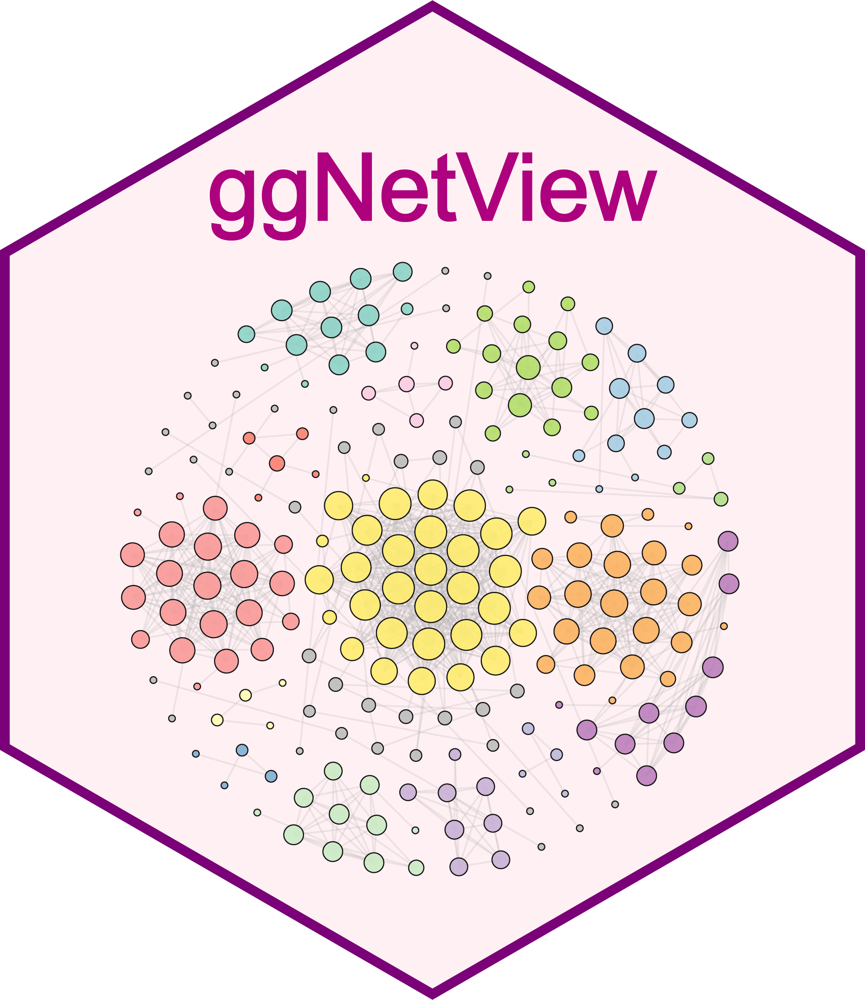

<!-- README.md is generated from README.Rmd. Please edit that file -->

```{r, include = FALSE}
knitr::opts_chunk$set(
  collapse = TRUE,
  comment = "#>",
  fig.path = "man/figures/README-",
  out.width = "100%"
)
```

# ggNetView 

<!-- badges: start -->
<!-- badges: end -->

ggNetView is an R package for network analysis and visualization. It provides flexible and publication-ready tools for exploring complex biological and ecological networks.


</br>
</br>
</br>

## Installation

You can install the development version of ggNetView from [GitHub](https://github.com/) with:

```
# install.packages("devtools")
devtools::install_github("Jiawang1209/ggNetView")
```

or

```
# install.packages("pak")
pak::pak("Jiawang1209/ggNetView")
```

## Example

### Step1: load ggNetView

```{r}
library(ggNetView)
```

### Step2: load Data

> You can load raw matrix

```{r}
data("otu_tab")

otu_tab[1:5, 1:5]
```


> You can load rarely matrix

```{r}
data("otu_rare")

otu_tab[1:5, 1:5]
```

> 

```{r}
data("otu_rare_relative")

otu_rare_relative[1:5, 1:5]

```

> You can load node annotation 

```{r}
data("tax_tab")

tax_tab[1:5, 1:5]
```


### Step3: create graph object

```{r}
obj <- build_graph_from_mat(
  mat = otu_rare_relative,
  transfrom.method = "none",
  method = "WGCNA",
  cor.method = "pearson",
  proc = "BH",
  r.threshold = 0.7,
  p.threshold = 0.05,
  node_annotation = tax_tab
)
```


### Step4: ggNetView to plot

```{r fig.align='center', fig.width=10, fig.height=10}
p1 <- ggNetView(
  graph_obj = obj,
  layout = "gephi",
  layout.module = "adjacent",
  group.by = "Modularity",
  pointsize = c(1, 5),
  center = F,
  jitter = F,
  mapping_line = F,
  shrink = 0.9,
  linealpha = 0.2,
  linecolor = "#d9d9d9"
) 

p1
```


```{r fig.align='center', fig.width=15, fig.height=15}
p2 <- ggNetView(
  graph_obj = obj,
  layout = "gephi",
  layout.module = "random",
  group.by = "Modularity",
  pointsize = c(1, 5),
  center = F,
  jitter = TRUE,
  jitter_sd = 0.15,
  mapping_line = TRUE,
  shrink = 0.9,
  linealpha = 0.2,
  linecolor = "#d9d9d9",
  add_outer = T,
  label = T
) 

p2
```


### Step5: save plot

```
ggsave(file = "Output/p1.pdf",
       plot = p1,
       height = 10,
       width = 10)


ggsave(file = "Output/p2.pdf",
       plot = p2,
       height = 10,
       width = 10)
```


#### Citation

If you use ggNetView in your research, please cite:

```
Yue Liu (2025). ggNetView: An R package for complex biological and ecological network analysis and visualization. R package version 0.1.0. 
https://github.com/Jiawang1209/ggNetView
```

<h4 align="center">©微信公众号 RPython</h5>
