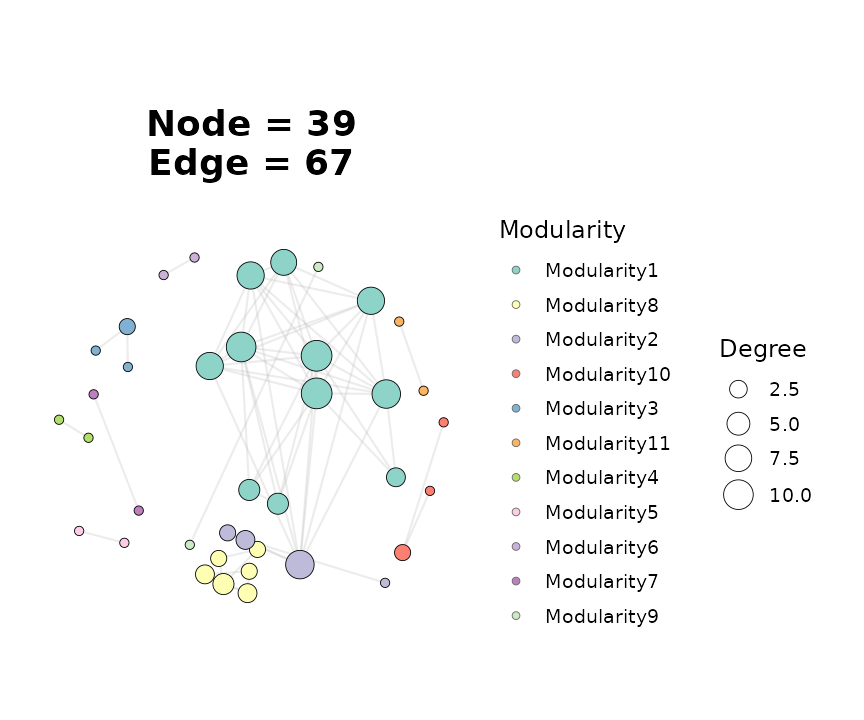
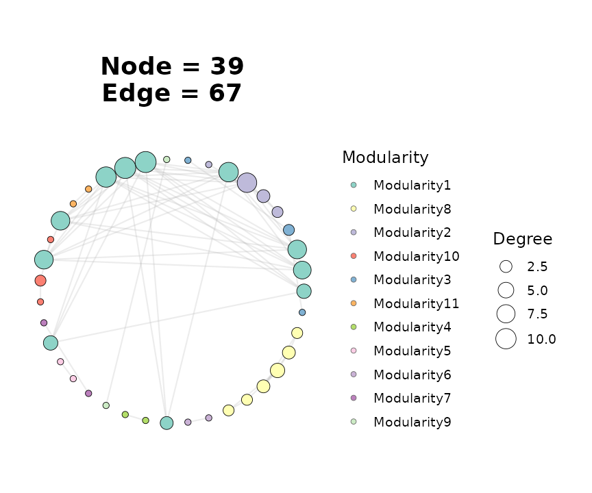
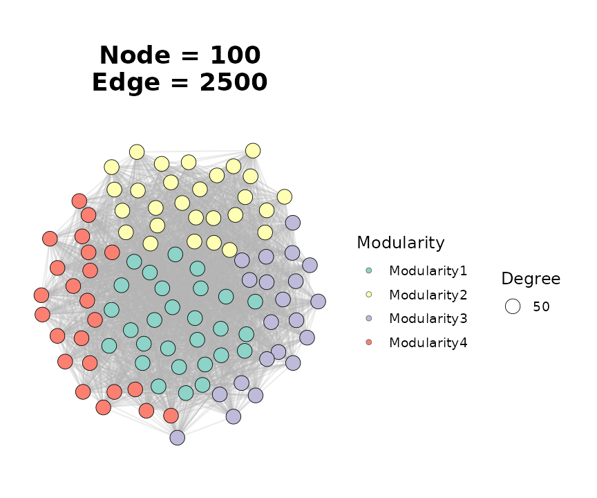
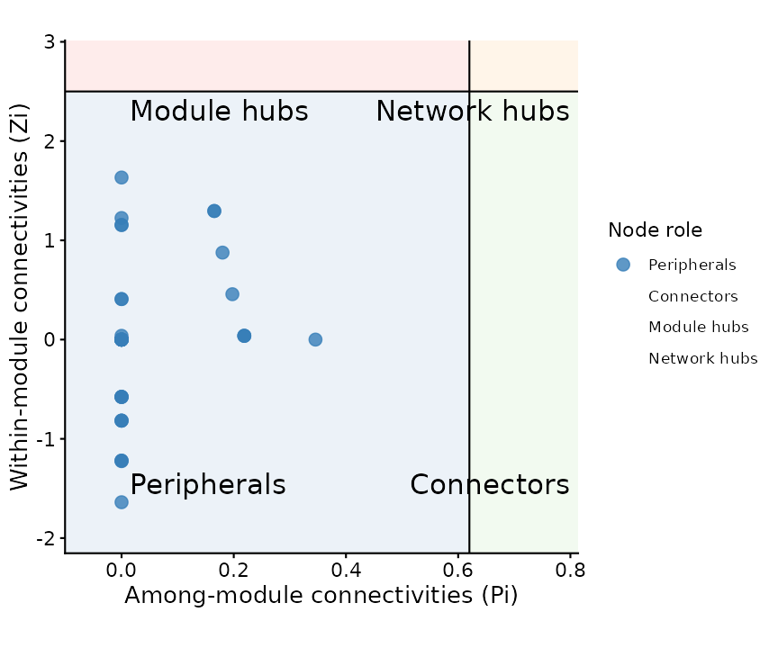

# Correlation-based Network Pipelines

## Overview

This vignette walks through the correlation-network family of builders
in `ggNetView`. These functions turn one or more numeric abundance /
expression tables into a unified, module-annotated graph object that can
be plotted directly with
[`ggNetView()`](https://jiawang1209.github.io/ggNetView/reference/ggNetView.md).

The three main entry points are:

- [`build_graph_from_mat()`](https://jiawang1209.github.io/ggNetView/reference/build_graph_from_mat.md)
  — single matrix, correlation network across its rows (e.g. OTUs,
  genes, metabolites).
- [`build_graph_from_double_mat()`](https://jiawang1209.github.io/ggNetView/reference/build_graph_from_double_mat.md)
  — two matrices (two feature blocks) measured on the same samples;
  edges represent cross-block correlations.
- [`build_graph_from_multi_mat()`](https://jiawang1209.github.io/ggNetView/reference/build_graph_from_multi_mat.md)
  — generalizes the double-matrix case to three or more feature blocks.

All three return a `tidygraph` object carrying correlation sign, edge
weight, and a deterministic module assignment.

``` r

library(ggNetView)
#> 
#>                                                ░██               ░██
#>                                                ░██
#>  ░████████  ░████████ ░████████   ░███████  ░████████ ░██    ░██ ░██ ░███████  ░██    ░██    ░██
#> ░██    ░██ ░██    ░██ ░██    ░██ ░██    ░██    ░██    ░██    ░██ ░██░██    ░██ ░██    ░██    ░██
#> ░██    ░██ ░██    ░██ ░██    ░██ ░█████████    ░██     ░██  ░██  ░██░█████████  ░██  ░████  ░██
#> ░██   ░███ ░██   ░███ ░██    ░██ ░██           ░██      ░██░██   ░██░██          ░██░██ ░██░██
#>  ░█████░██  ░█████░██ ░██    ░██  ░███████      ░████    ░███    ░██ ░███████     ░███   ░███
#>        ░██        ░██
#>  ░███████   ░███████
#> 
#> 
#> ggNetView: Reproducible and Deterministic Network Analysis and Visualization
#> Version: 0.2.1
#> 
#>   Authors:     Yue Liu, Chao Wang
#>   Maintainer:  Yue Liu <yueliu@iae.ac.cn>
#> 
#>   Manual:      https://jiawang1209.github.io/ggNetView-manual/
#>   GitHub:      https://github.com/Jiawang1209/ggNetView
#>   Bug Reports: https://github.com/Jiawang1209/ggNetView/issues
#> 
#>   Type citation('ggNetView') for how to cite this package.
```

## 1. Single-matrix correlation network

[`build_graph_from_mat()`](https://jiawang1209.github.io/ggNetView/reference/build_graph_from_mat.md)
expects a numeric matrix with **features in rows** and **samples in
columns**. The package ships `otu_rare_relative`, a relative-abundance
OTU table. For a fast example we subset to the 60 most abundant OTUs.

``` r

data(otu_rare_relative)

mat <- as.matrix(otu_rare_relative)
row_sums <- rowSums(mat)
mat <- mat[order(row_sums, decreasing = TRUE)[seq_len(60)], ]

graph_obj <- build_graph_from_mat(
  mat           = mat,
  method        = "cor",
  cor.method    = "spearman",
  proc          = "BH",
  r.threshold   = 0.6,
  p.threshold   = 0.05,
  module.method = "Fast_greedy",
  seed          = 1
)
#> The max module in network is 11 we use the 11  modules for next analysis

graph_obj
#> # A tbl_graph: 39 nodes and 67 edges
#> #
#> # An undirected simple graph with 10 components
#> #
#> # Node Data: 39 × 7 (active)
#>    name   modularity modularity2 modularity3 Modularity Degree Strength
#>    <chr>  <fct>      <ord>       <chr>       <ord>       <dbl>    <dbl>
#>  1 ASV_41 1          1           1           1              11     8.80
#>  2 ASV_39 1          1           1           1              11     8.65
#>  3 ASV_10 1          1           1           1              10     7.73
#>  4 ASV_6  1          1           1           1               9     7.21
#>  5 ASV_2  1          1           1           1               8     6.50
#>  6 ASV_17 1          1           1           1               8     6.44
#>  7 ASV_44 1          1           1           1               8     6.15
#>  8 ASV_56 1          1           1           1               7     5.07
#>  9 ASV_24 1          1           1           1               4     2.90
#> 10 ASV_62 1          1           1           1               4     2.92
#> # ℹ 29 more rows
#> #
#> # Edge Data: 67 × 5
#>    from    to weight correlation corr_direction
#>   <int> <int>  <dbl>       <dbl> <chr>         
#> 1    15    17  0.750       0.750 Positive      
#> 2    12    15  0.730       0.730 Positive      
#> 3     4     5  0.783       0.783 Positive      
#> # ℹ 64 more rows
```

### Choosing an inference method

The `method` argument selects how edges are inferred:

| `method` | Engine | P-values | Typical use |
|----|----|----|----|
| `"cor"` | [`psych::corr.test()`](https://rdrr.io/pkg/psych/man/corr.test.html) | yes | General-purpose |
| `"Hmisc"` | [`Hmisc::rcorr()`](https://rdrr.io/pkg/Hmisc/man/rcorr.html) | yes | Large matrices, Pearson / Spearman only |
| `"WGCNA"` | [`WGCNA::corAndPvalue()`](https://rdrr.io/pkg/WGCNA/man/corAndPvalue.html) | yes | Gene co-expression |
| `"SPARCC"` | Internal Rcpp SparCC + bootstrap | yes | Compositional microbiome data |
| `"SpiecEasi"` | Internal Rcpp SpiecEasi (`mb` / `glasso`) | no | Sparse inverse-covariance |

Switch methods by changing a single argument — the rest of the pipeline
(`r.threshold`, module detection, attribute assembly) stays the same.

### Attaching taxonomy

Passing a node annotation table merges metadata onto the vertices. The
first column of the annotation must match the feature names.

``` r

data(tax_tab)

annot <- tax_tab[tax_tab$OTUID %in% rownames(mat), ]
graph_obj_annot <- build_graph_from_mat(
  mat             = mat,
  method          = "cor",
  cor.method      = "spearman",
  proc            = "BH",
  r.threshold     = 0.6,
  p.threshold     = 0.05,
  module.method   = "Fast_greedy",
  node_annotation = annot,
  seed            = 1
)
#> The max module in network is 11 we use the 11  modules for next analysis
```

Downstream plots can now colour or facet by any taxonomy column
(`Phylum`, `Class`, …).

## 2. Visualising the network

[`ggNetView()`](https://jiawang1209.github.io/ggNetView/reference/ggNetView.md)
is the single plotting entry point. Edge colour follows correlation sign
automatically; node fill can be driven by `Modularity` or any column
attached via `node_annotation`.

``` r

ggNetView(
  graph_obj_annot,
  layout    = "fr",
  seed      = 1,
  node_size_range = c(2, 7),
  node_fill   = "Modularity",
  module_label     = FALSE
)
```



Swap layouts by changing the `layout` string — every layout uses the
supplied `seed` so figures are reproducible.

``` r

ggNetView(
  graph_obj_annot,
  layout    = "circle",
  seed      = 1,
  node_size_range = c(2, 7),
  node_fill   = "Modularity"
)
```



## 3. Two-block (double-matrix) networks

Use
[`build_graph_from_double_mat()`](https://jiawang1209.github.io/ggNetView/reference/build_graph_from_double_mat.md)
when you have two feature blocks measured on the same samples and want
edges that only cross between the two blocks (e.g. bacteria ↔︎ fungi, or
microbes ↔︎ metabolites).

Both matrices must share the same sample column names.

``` r

data(BASV_tab)
data(FASV_tab)

mat_b <- as.matrix(BASV_tab)
mat_f <- as.matrix(FASV_tab)

double_obj <- build_graph_from_double_mat(
  mat1          = mat_b,
  mat2          = mat_f,
  module.method = "Fast_greedy",
  seed          = 1
)
#> The max module in network is 4 we use the 4  modules for next analysis

double_obj
#> # A tbl_graph: 100 nodes and 2500 edges
#> #
#> # An undirected simple graph with 1 component
#> #
#> # Node Data: 100 × 8 (active)
#>    name   modularity modularity2 modularity3 Modularity Degree Segree Strength
#>    <chr>  <fct>      <fct>       <chr>       <fct>       <dbl>  <dbl>    <dbl>
#>  1 BASV3  1          1           1           1              50     50    12.5 
#>  2 BASV6  1          1           1           1              50     50     9.86
#>  3 BASV8  1          1           1           1              50     50    13.7 
#>  4 BASV13 1          1           1           1              50     50    13.6 
#>  5 BASV17 1          1           1           1              50     50    14.1 
#>  6 BASV19 1          1           1           1              50     50    13.2 
#>  7 BASV25 1          1           1           1              50     50    12.5 
#>  8 BASV26 1          1           1           1              50     50    12.9 
#>  9 BASV27 1          1           1           1              50     50    14.2 
#> 10 BASV31 1          1           1           1              50     50    14.8 
#> # ℹ 90 more rows
#> #
#> # Edge Data: 2,500 × 5
#>    from    to weight correlation corr_direction
#>   <int> <int>  <dbl>       <dbl> <chr>         
#> 1    15    57  0.338      -0.338 Negative      
#> 2    57    90  0.648       0.648 Positive      
#> 3    16    57  0.162       0.162 Positive      
#> # ℹ 2,497 more rows
```

The returned graph behaves identically to the single-matrix case, so the
same
[`ggNetView()`](https://jiawang1209.github.io/ggNetView/reference/ggNetView.md)
call works:

``` r

ggNetView(
  double_obj,
  layout    = "fr",
  seed      = 1,
  node_size_range = c(2, 6),
  node_fill   = "Modularity",
  module_label     = FALSE
)
```



For a bipartite-style rendering, swap `layout = "fr"` for `"bipartite"`
and supply the block assignment via `node_annotation`.

## 4. Multi-block networks

[`build_graph_from_multi_mat()`](https://jiawang1209.github.io/ggNetView/reference/build_graph_from_multi_mat.md)
is the natural extension to three or more blocks. Matrices are passed
positionally or via `...`; the function intersects sample names and
stacks features.

``` r

set.seed(1)
nsamp <- 20
mat_a <- matrix(stats::rnorm(10 * nsamp), nrow = 10)
mat_b <- matrix(stats::rnorm(10 * nsamp), nrow = 10)
mat_c <- matrix(stats::rnorm(10 * nsamp), nrow = 10)
rownames(mat_a) <- paste0("A", seq_len(10))
rownames(mat_b) <- paste0("B", seq_len(10))
rownames(mat_c) <- paste0("C", seq_len(10))
colnames(mat_a) <- colnames(mat_b) <- colnames(mat_c) <-
  paste0("sample", seq_len(nsamp))

multi_obj <- build_graph_from_multi_mat(
  mat_a, mat_b, mat_c,
  module.method = "Fast_greedy",
  seed          = 1
)
#> The max module in network is 5 we use the 5  modules for next analysis

multi_obj
#> # A tbl_graph: 30 nodes and 300 edges
#> #
#> # An undirected simple graph with 1 component
#> #
#> # Node Data: 30 × 8 (active)
#>    name  modularity modularity2 modularity3 Modularity Degree Segree Strength
#>    <chr> <fct>      <fct>       <chr>       <fct>       <dbl>  <dbl>    <dbl>
#>  1 A1    1          1           1           1              20     20     8.54
#>  2 A6    1          1           1           1              20     20     8.30
#>  3 A9    1          1           1           1              20     20     7.06
#>  4 B2    1          1           1           1              20     20     6.69
#>  5 B6    1          1           1           1              20     20     8.04
#>  6 B8    1          1           1           1              20     20     8.36
#>  7 C3    1          1           1           1              20     20     5.57
#>  8 C5    1          1           1           1              20     20     5.39
#>  9 C6    1          1           1           1              20     20     5.98
#> 10 C10   1          1           1           1              20     20     7.25
#> # ℹ 20 more rows
#> #
#> # Edge Data: 300 × 5
#>    from    to weight correlation corr_direction
#>   <int> <int>  <dbl>       <dbl> <chr>         
#> 1     1    18  0.693      -0.693 Negative      
#> 2     1     4  0.313      -0.313 Negative      
#> 3     1    29  0.904      -0.904 Negative      
#> # ℹ 297 more rows
```

## 5. Inspecting the result

All three builders return a `tidygraph` object, so node- and edge-level
tibbles are directly accessible via
[`get_graph_nodes()`](https://jiawang1209.github.io/ggNetView/reference/get_graph_nodes.md)
and
[`get_info_from_graph()`](https://jiawang1209.github.io/ggNetView/reference/get_info_from_graph.md):

``` r

head(get_graph_nodes(graph_obj))
#>     name modularity modularity2 modularity3 Modularity Degree Strength
#> 1 ASV_41          1           1           1          1     11 8.800914
#> 2 ASV_39          1           1           1          1     11 8.653297
#> 3 ASV_10          1           1           1          1     10 7.729325
#> 4  ASV_6          1           1           1          1      9 7.212516
#> 5  ASV_2          1           1           1          1      8 6.495174
#> 6 ASV_17          1           1           1          1      8 6.444404
lapply(get_info_from_graph(graph_obj), head, 3)
#> $node_info
#> # A tibble: 3 × 4
#>   name   Modularity Degree Strength
#>   <chr>  <ord>       <dbl>    <dbl>
#> 1 ASV_41 1              11     8.80
#> 2 ASV_39 1              11     8.65
#> 3 ASV_10 1              10     7.73
#> 
#> $edge_info
#> # A tibble: 3 × 5
#>   from   to     weight correlation corr_direction
#>   <chr>  <chr>   <dbl>       <dbl> <chr>         
#> 1 ASV_1  ASV_21  0.750       0.750 Positive      
#> 2 ASV_34 ASV_1   0.730       0.730 Positive      
#> 3 ASV_6  ASV_2   0.783       0.783 Positive
```

Every node carries:

- `Modularity` — top-k module label (`Others` bucket when many small
  modules)
- `Degree`, `Strength` — degree and weighted degree
- any column merged in through `node_annotation`

Every edge carries:

- `weight` — absolute correlation
- `correlation` — signed correlation
- `corr_direction` — `"Positive"` / `"Negative"`

## 6. Network topology

[`get_network_topology()`](https://jiawang1209.github.io/ggNetView/reference/get_network_topology.md)
computes global network metrics plus a bootstrap-based robustness
summary. It accepts either a pre-built graph object or a raw matrix — in
the latter case the builder is re-run internally so that the same
`r.threshold` / `p.threshold` / `method` combination is applied.

``` r

topo <- get_network_topology(graph_obj = graph_obj, bootstrap = 20)
names(topo)
#> [1] "topology"   "Robustness"
head(topo$topology)
#> # A tibble: 6 × 3
#>   Topology Target_network Random_nerwork
#>   <chr>             <dbl>          <dbl>
#> 1 Node            39             39     
#> 2 Edge            67             67     
#> 3 Degree           3.44           3.44  
#> 4 Distance         1.27           2.95  
#> 5 Diameter         3.04           6.45  
#> 6 Density          0.0904         0.0904
```

The return value is a list with at least two elements:

- `topology` — one row of global metrics (number of nodes / edges,
  average degree, clustering coefficient, modularity, …).
- `robustness` — bootstrap summary of how network-level metrics behave
  under random node removal, used to estimate stability.

For sample × feature designs (e.g. microbiome studies with many samples)
use
[`get_sample_subgraph_topology()`](https://jiawang1209.github.io/ggNetView/reference/get_sample_subgraph_topology.md)
or its `_parallel` variant to compute the same metrics per-sample.

## 7. Keystone detection with Zi-Pi

[`ggnetview_zipi()`](https://jiawang1209.github.io/ggNetView/reference/ggnetview_zipi.md)
classifies every node by its within-module connectivity (Zi) and
among-module participation coefficient (Pi). The default thresholds
(`Zi = 2.5`, `Pi = 0.62`) are those of Guimerà & Amaral (2005) and split
nodes into four roles:

- **Peripherals** — low Zi, low Pi
- **Connectors** — low Zi, high Pi
- **Module hubs** — high Zi, low Pi
- **Network hubs** — high Zi, high Pi

It takes a node table and an adjacency matrix — both of which are
accessible directly from a `ggNetView` graph object:

``` r

nodes_tbl <- get_graph_nodes(graph_obj)
adj_mat   <- get_graph_adjacency(graph_obj)

zipi <- ggnetview_zipi(
  nodes_bulk     = nodes_tbl,
  z_bulk_mat     = adj_mat,
  modularity_col = "Modularity",
  degree_col     = "Degree"
)

head(zipi$data[, c("name", "within_module_connectivities",
                   "among_module_connectivities", "type")])
#>     name within_module_connectivities among_module_connectivities        type
#> 1 ASV_41                   1.29567300                   0.1652893 Peripherals
#> 2 ASV_39                   1.29567300                   0.1652893 Peripherals
#> 3 ASV_10                   0.87648467                   0.1800000 Peripherals
#> 4  ASV_6                   0.45729635                   0.1975309 Peripherals
#> 5  ASV_2                   0.03810803                   0.2187500 Peripherals
#> 6 ASV_17                   0.03810803                   0.2187500 Peripherals
```

The `plot` element in the result is a ready-to-render Zi-Pi scatter plot
with the four quadrants shaded:

``` r

zipi$plot
```



## 8. Where to go next

- **Layout gallery**: pass any `layout = "..."` string accepted by
  [`ggNetView()`](https://jiawang1209.github.io/ggNetView/reference/ggNetView.md)
  — there are 30+ deterministic layouts, including
  `"circular_modules_petal"`, `"cross_quadripartite_gephi"`, and
  `"star_concentric"`.
- **Module comparison across networks**: build a named list of graph
  objects and feed it to `get_network_topology(graph_obj_list = ...)` to
  get per-network metrics in one call; use
  [`ggnetview_modularity_heatmaps()`](https://jiawang1209.github.io/ggNetView/reference/ggnetview_modularity_heatmaps.md)
  to visualise module composition side-by-side.
- **RMT thresholding**:
  [`ggNetView_RMT()`](https://jiawang1209.github.io/ggNetView/reference/ggNetView_RMT.md)
  picks a data-driven correlation threshold using random matrix theory —
  useful when you do not want to hand-tune `r.threshold`.
- **Multi-network rendering**:
  [`ggNetView_multi()`](https://jiawang1209.github.io/ggNetView/reference/ggNetView_multi.md)
  /
  [`ggNetView_multi_link()`](https://jiawang1209.github.io/ggNetView/reference/ggNetView_multi_link.md)
  plot several networks in a shared coordinate system with aligned
  modules.

## Session information

``` r

sessionInfo()
#> R version 4.6.1 (2026-06-24)
#> Platform: x86_64-pc-linux-gnu
#> Running under: Ubuntu 24.04.4 LTS
#> 
#> Matrix products: default
#> BLAS:   /usr/lib/x86_64-linux-gnu/openblas-pthread/libblas.so.3 
#> LAPACK: /usr/lib/x86_64-linux-gnu/openblas-pthread/libopenblasp-r0.3.26.so;  LAPACK version 3.12.0
#> 
#> locale:
#>  [1] LC_CTYPE=C.UTF-8       LC_NUMERIC=C           LC_TIME=C.UTF-8       
#>  [4] LC_COLLATE=C.UTF-8     LC_MONETARY=C.UTF-8    LC_MESSAGES=C.UTF-8   
#>  [7] LC_PAPER=C.UTF-8       LC_NAME=C              LC_ADDRESS=C          
#> [10] LC_TELEPHONE=C         LC_MEASUREMENT=C.UTF-8 LC_IDENTIFICATION=C   
#> 
#> time zone: UTC
#> tzcode source: system (glibc)
#> 
#> attached base packages:
#> [1] stats     graphics  grDevices utils     datasets  methods   base     
#> 
#> other attached packages:
#> [1] future_1.75.0   ggNetView_0.2.1
#> 
#> loaded via a namespace (and not attached):
#>  [1] gtable_0.3.6        xfun_0.60           bslib_0.12.0       
#>  [4] ggplot2_4.0.3       htmlwidgets_1.6.4   psych_2.6.5        
#>  [7] ggrepel_0.9.8       lattice_0.22-9      vctrs_0.7.3        
#> [10] tools_4.6.1         generics_0.1.4      parallel_4.6.1     
#> [13] tibble_3.3.1        pkgconfig_2.0.3     Matrix_1.7-5       
#> [16] ggnewscale_0.5.2    RColorBrewer_1.1-3  S7_0.2.2           
#> [19] desc_1.4.3          lifecycle_1.0.5     compiler_4.6.1     
#> [22] farver_2.1.2        stringr_1.6.0       textshaping_1.0.5  
#> [25] mnormt_2.1.2        ggforce_0.5.0       graphlayouts_1.2.5 
#> [28] codetools_0.2-20    htmltools_0.5.9     sass_0.4.10        
#> [31] yaml_2.3.12         pillar_1.11.1       pkgdown_2.2.1      
#> [34] jquerylib_0.1.4     tidyr_1.3.2         MASS_7.3-65        
#> [37] cachem_1.1.0        viridis_0.6.5       parallelly_1.48.0  
#> [40] nlme_3.1-169        tidyselect_1.2.1    digest_0.6.39      
#> [43] stringi_1.8.9       dplyr_1.2.1         purrr_1.2.2        
#> [46] listenv_1.0.0       labeling_0.4.3      polyclip_1.10-7    
#> [49] fastmap_1.2.0       grid_4.6.1          cli_3.6.6          
#> [52] magrittr_2.0.5      ggraph_2.2.2        tidygraph_1.3.1    
#> [55] utf8_1.2.6          future.apply_1.20.2 withr_3.0.3        
#> [58] scales_1.4.0        rmarkdown_2.32      globals_0.19.1     
#> [61] igraph_2.3.3        otel_0.2.0          gridExtra_2.3.1    
#> [64] ragg_1.5.2          memoise_2.0.1       evaluate_1.0.5     
#> [67] knitr_1.52          viridisLite_0.4.3   rlang_1.3.0        
#> [70] Rcpp_1.1.2          glue_1.8.1          tweenr_2.0.3       
#> [73] jsonlite_2.0.0      R6_2.6.1            systemfonts_1.3.2  
#> [76] fs_2.1.0
```
