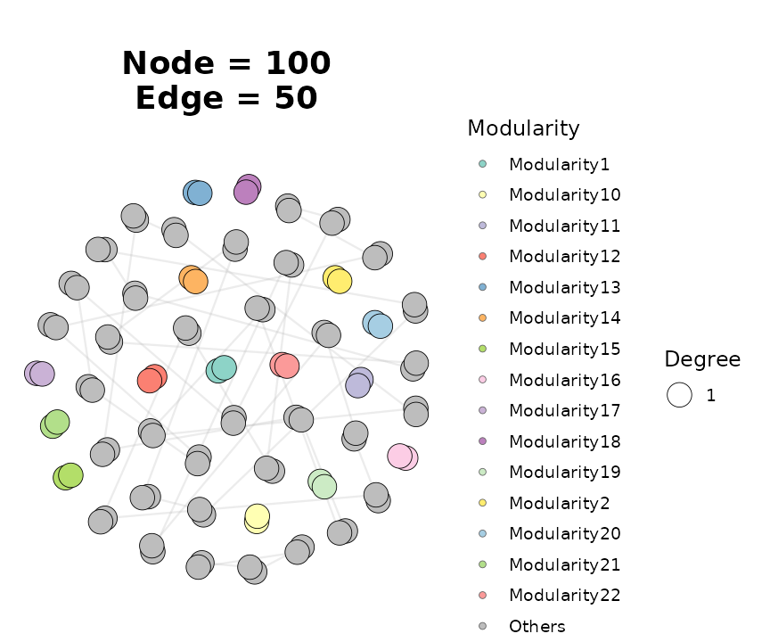
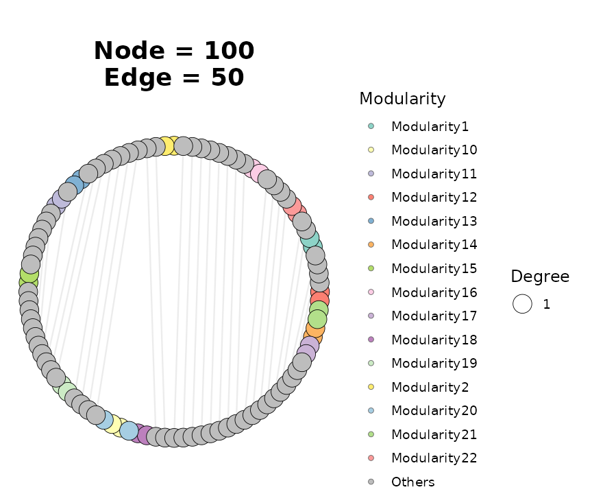

# Introduction to ggNetView

## Overview

`ggNetView` provides a reproducible, deterministic framework for
analyzing and visualizing biological, ecological, and microbial
association networks. The package combines:

- a family of `build_graph_from_*()` functions that turn adjacency
  matrices, correlation matrices, edge lists, or `igraph` objects into a
  unified `tidygraph`-backed network object with module annotations;
- topology utilities
  ([`get_network_topology()`](https://jiawang1209.github.io/ggNetView/reference/get_network_topology.md),
  [`get_info_from_graph()`](https://jiawang1209.github.io/ggNetView/reference/get_info_from_graph.md),
  [`get_graph_nodes()`](https://jiawang1209.github.io/ggNetView/reference/get_graph_nodes.md))
  for node- and network-level metrics;
- a large collection of deterministic layout generators (dispatched
  through
  [`ggNetView()`](https://jiawang1209.github.io/ggNetView/reference/ggNetView.md)
  via the `layout` argument); and
- a `ggplot2`-compatible plotting function
  [`ggNetView()`](https://jiawang1209.github.io/ggNetView/reference/ggNetView.md)
  for publication-quality figures.

This vignette walks through an end-to-end workflow: loading a bundled
example, building a graph object, extracting information, and rendering
a plot.

## Load the package

``` r
library(ggNetView)
#> 
#>    ____   ____  _   _      _ __     ___
#>   / ___| / ___|| \ | | ___| |\ \   / (_) _____      __
#>  | |  _ | |  _ |  \| |/ _ \ __\ \ / /| |/ _ \ \ /\ / /
#>  | |_| || |_| || |\  |  __/ |_ \ V / | |  __/\ V  V /
#>   \____| \____||_| \_|\___|\__| \_/  |_|\___| \_/\_/
#> 
#> ggNetView: Reproducible and Deterministic Network Analysis and Visualization
#> Version: 0.1.0
#> 
#>   Authors:     Yue Liu, Chao Wang
#>   Maintainer:  Yue Liu <yueliu@iae.ac.cn>
#> 
#>   Manual:      https://jiawang1209.github.io/ggNetView-manual/
#>   GitHub:      https://github.com/Jiawang1209/ggNetView
#>   Bug Reports: https://github.com/Jiawang1209/ggNetView/issues
#> 
#>   Type citation('ggNetView') for how to cite this package.
library(igraph)
#> 
#> Attaching package: 'igraph'
#> The following objects are masked from 'package:stats':
#> 
#>     decompose, spectrum
#> The following object is masked from 'package:base':
#> 
#>     union
```

## 1. Build a graph object

`ggNetView` ships with several example datasets. We use `ppi_example`, a
small protein–protein interaction network with 100 nodes and 200 edges.

``` r
data(ppi_example)

ig <- igraph::graph_from_data_frame(
  d        = ppi_example$ppi,
  vertices = ppi_example$annotation,
  directed = FALSE
)

graph_obj <- build_graph_from_igraph(
  igraph        = ig,
  module.method = "Fast_greedy"
)

graph_obj
#> # A tbl_graph: 100 nodes and 50 edges
#> #
#> # An unrooted forest with 50 trees
#> #
#> # Node Data: 100 × 8 (active)
#>    name  group modularity modularity2 modularity3 Modularity Degree Strength
#>    <chr> <chr> <fct>      <ord>       <chr>       <ord>       <dbl>    <dbl>
#>  1 C13   C     1          1           1           1               1     26.7
#>  2 C28   C     1          1           1           1               1     26.7
#>  3 C2    C     10         10          10          10              1     37.4
#>  4 D9    D     10         10          10          10              1     37.4
#>  5 A3    A     11         11          11          11              1     37.8
#>  6 D38   D     11         11          11          11              1     37.8
#>  7 B12   B     12         12          12          12              1     41.3
#>  8 D19   D     12         12          12          12              1     41.3
#>  9 A1    A     13         13          13          13              1     45.2
#> 10 D40   D     13         13          13          13              1     45.2
#> # ℹ 90 more rows
#> #
#> # Edge Data: 50 × 3
#>    from    to weight
#>   <int> <int>  <dbl>
#> 1     9    10   45.2
#> 2    15    16   50.6
#> 3     5     6   37.8
#> # ℹ 47 more rows
```

[`build_graph_from_igraph()`](https://jiawang1209.github.io/ggNetView/reference/build_graph_from_igraph.md)
detects communities (here with the Fast-greedy algorithm), simplifies
any multi-edges or self-loops, and attaches node-level attributes
(`Modularity`, `Degree`, `Strength`) for downstream plotting.

## 2. Inspect nodes and edges

Use
[`get_graph_nodes()`](https://jiawang1209.github.io/ggNetView/reference/get_graph_nodes.md)
for a quick node tibble, or
[`get_info_from_graph()`](https://jiawang1209.github.io/ggNetView/reference/get_info_from_graph.md)
for both nodes and edges as a list.

``` r
nodes <- get_graph_nodes(graph_obj)
head(nodes)
#>   name group modularity modularity2 modularity3 Modularity Degree Strength
#> 1  C13     C          1           1           1          1      1 26.73367
#> 2  C28     C          1           1           1          1      1 26.73367
#> 3   C2     C         10          10          10         10      1 37.37186
#> 4   D9     D         10          10          10         10      1 37.37186
#> 5   A3     A         11          11          11         11      1 37.80905
#> 6  D38     D         11          11          11         11      1 37.80905

info <- get_info_from_graph(graph_obj)
lapply(info, head, 3)
#> $node_info
#> # A tibble: 3 × 5
#>   name  group Modularity Degree Strength
#>   <chr> <chr> <ord>       <dbl>    <dbl>
#> 1 C13   C     1               1     26.7
#> 2 C28   C     1               1     26.7
#> 3 C2    C     10              1     37.4
#> 
#> $edge_info
#> # A tibble: 3 × 3
#>   from  to    weight
#>   <chr> <chr>  <dbl>
#> 1 A1    D40     45.2
#> 2 A2    D39     50.6
#> 3 A3    D38     37.8
```

## 3. Visualize with `ggNetView()`

The
[`ggNetView()`](https://jiawang1209.github.io/ggNetView/reference/ggNetView.md)
function is the main entry point for plotting. The `layout` argument
selects one of the deterministic layout generators shipped with the
package. Below we render the network with the Fruchterman–Reingold
layout and color nodes by module.

``` r
ggNetView(
  graph_obj,
  layout    = "fr",
  seed      = 1,
  pointsize = c(2, 8),
  fill.by   = "Modularity",
  label     = FALSE
)
```



Switching layouts only requires changing the `layout` string. Here is
the same graph rendered on a circular layout:

``` r
ggNetView(
  graph_obj,
  layout    = "circle",
  seed      = 1,
  pointsize = c(2, 8),
  fill.by   = "Modularity"
)
```



Every layout in `ggNetView` uses a controllable `seed` so figures are
bit-for-bit reproducible across runs.

## 4. Next steps

For correlation-network pipelines from raw abundance tables, see
[`build_graph_from_mat()`](https://jiawang1209.github.io/ggNetView/reference/build_graph_from_mat.md),
[`build_graph_from_double_mat()`](https://jiawang1209.github.io/ggNetView/reference/build_graph_from_double_mat.md),
and the
[`get_network_topology()`](https://jiawang1209.github.io/ggNetView/reference/get_network_topology.md)
/
[`get_sample_subgraph_topology()`](https://jiawang1209.github.io/ggNetView/reference/get_sample_subgraph_topology.md)
families. For module-level comparisons across samples, see
[`ggnetview_modularity_heatmaps()`](https://jiawang1209.github.io/ggNetView/reference/ggnetview_modularity_heatmaps.md)
and
[`ggnetview_zipi()`](https://jiawang1209.github.io/ggNetView/reference/ggnetview_zipi.md).

## Session information

``` r
sessionInfo()
#> R version 4.5.3 (2026-03-11)
#> Platform: x86_64-pc-linux-gnu
#> Running under: Ubuntu 24.04.4 LTS
#> 
#> Matrix products: default
#> BLAS:   /usr/lib/x86_64-linux-gnu/openblas-pthread/libblas.so.3 
#> LAPACK: /usr/lib/x86_64-linux-gnu/openblas-pthread/libopenblasp-r0.3.26.so;  LAPACK version 3.12.0
#> 
#> locale:
#>  [1] LC_CTYPE=C.UTF-8       LC_NUMERIC=C           LC_TIME=C.UTF-8       
#>  [4] LC_COLLATE=C.UTF-8     LC_MONETARY=C.UTF-8    LC_MESSAGES=C.UTF-8   
#>  [7] LC_PAPER=C.UTF-8       LC_NAME=C              LC_ADDRESS=C          
#> [10] LC_TELEPHONE=C         LC_MEASUREMENT=C.UTF-8 LC_IDENTIFICATION=C   
#> 
#> time zone: UTC
#> tzcode source: system (glibc)
#> 
#> attached base packages:
#> [1] stats     graphics  grDevices utils     datasets  methods   base     
#> 
#> other attached packages:
#> [1] igraph_2.2.3    ggNetView_0.1.0
#> 
#> loaded via a namespace (and not attached):
#>  [1] viridis_0.6.5      sass_0.4.10        utf8_1.2.6         generics_0.1.4    
#>  [5] tidyr_1.3.2        stringi_1.8.7      digest_0.6.39      magrittr_2.0.5    
#>  [9] evaluate_1.0.5     grid_4.5.3         RColorBrewer_1.1-3 fastmap_1.2.0     
#> [13] jsonlite_2.0.0     ggrepel_0.9.8      ggnewscale_0.5.2   gridExtra_2.3     
#> [17] purrr_1.2.2        viridisLite_0.4.3  scales_1.4.0       tweenr_2.0.3      
#> [21] textshaping_1.0.5  jquerylib_0.1.4    cli_3.6.6          rlang_1.2.0       
#> [25] graphlayouts_1.2.3 polyclip_1.10-7    tidygraph_1.3.1    withr_3.0.2       
#> [29] cachem_1.1.0       yaml_2.3.12        tools_4.5.3        memoise_2.0.1     
#> [33] dplyr_1.2.1        ggplot2_4.0.2      vctrs_0.7.3        R6_2.6.1          
#> [37] lifecycle_1.0.5    stringr_1.6.0      fs_2.0.1           htmlwidgets_1.6.4 
#> [41] MASS_7.3-65        ragg_1.5.2         ggraph_2.2.2       pkgconfig_2.0.3   
#> [45] desc_1.4.3         pkgdown_2.2.0      pillar_1.11.1      bslib_0.10.0      
#> [49] gtable_0.3.6       glue_1.8.0         Rcpp_1.1.1         ggforce_0.5.0     
#> [53] systemfonts_1.3.2  xfun_0.57          tibble_3.3.1       tidyselect_1.2.1  
#> [57] knitr_1.51         farver_2.1.2       htmltools_0.5.9    labeling_0.4.3    
#> [61] rmarkdown_2.31     compiler_4.5.3     S7_0.2.1
```
