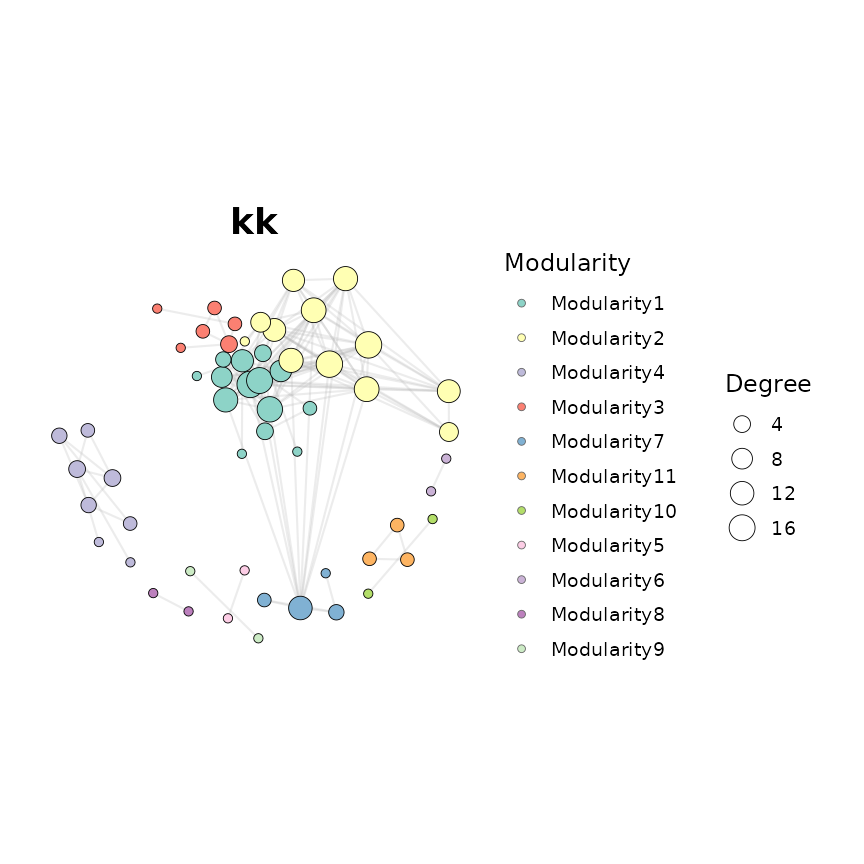
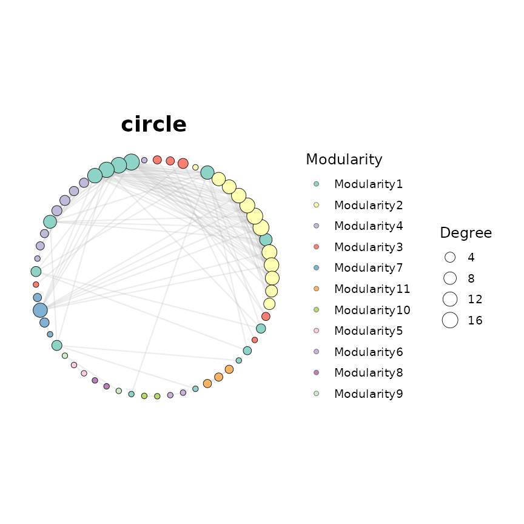
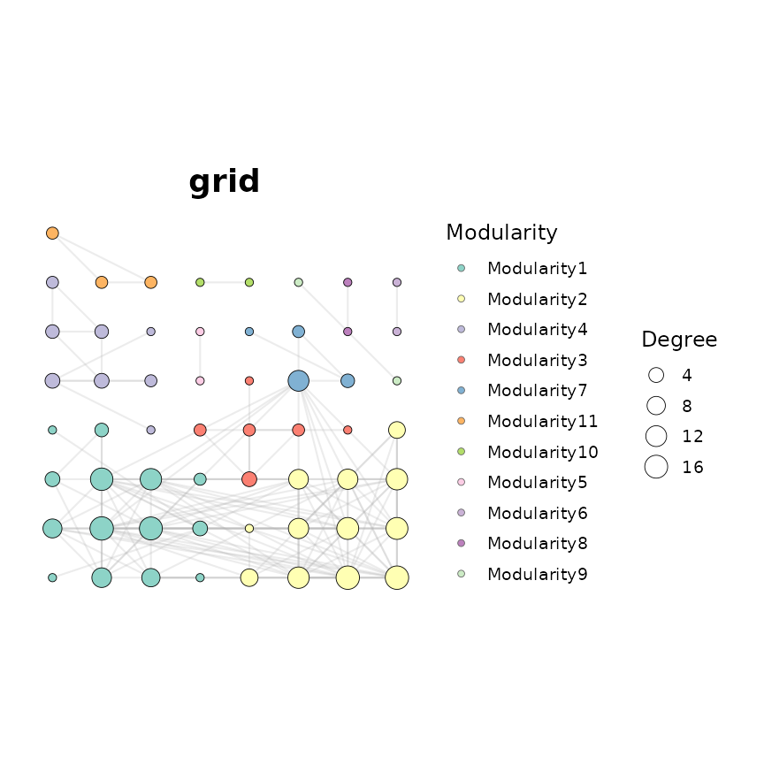
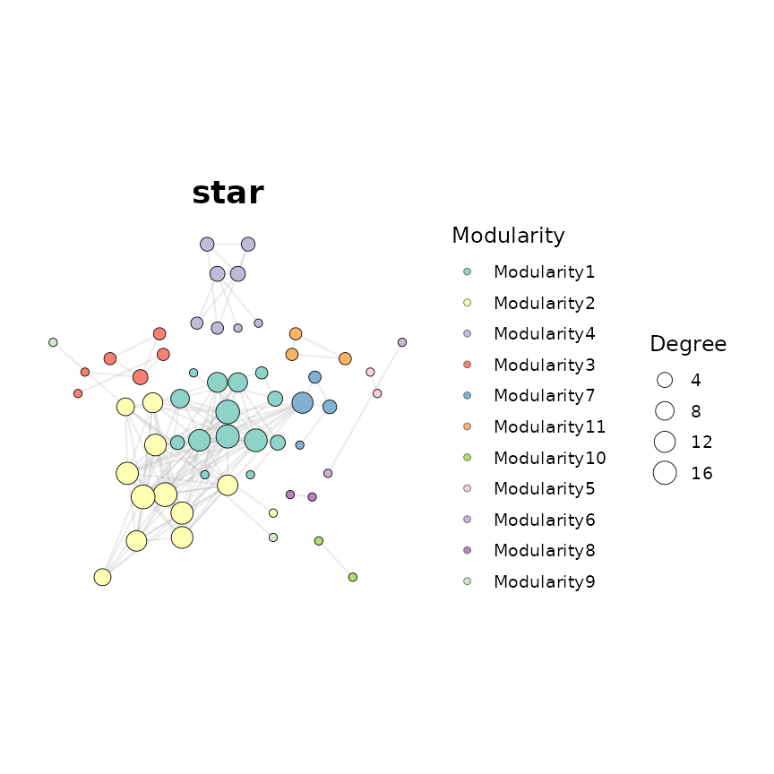
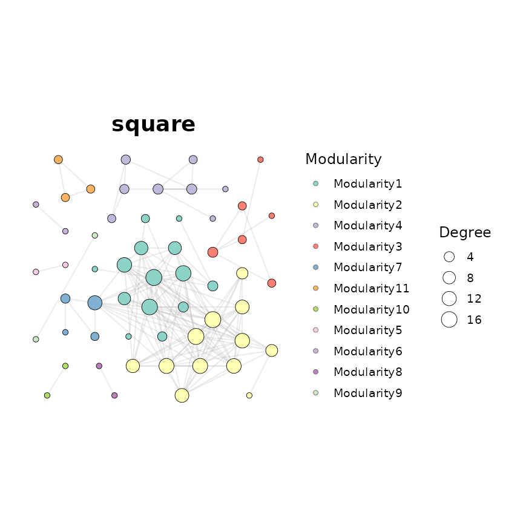
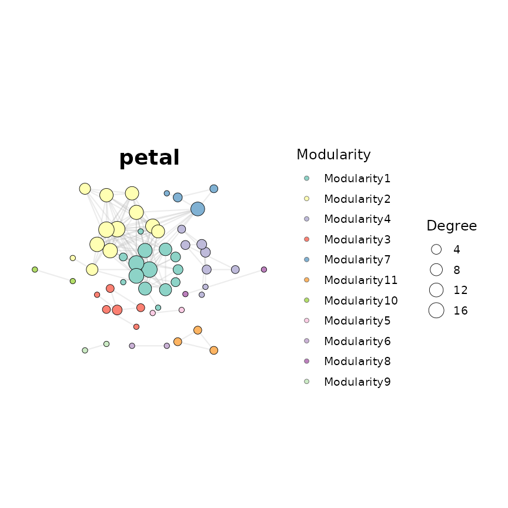

# Layout Gallery

## Overview

`ggNetView` ships 60+ deterministic layouts. Every layout is selected by
passing a single string to `ggNetView(layout = "...")`. The `seed`
argument ensures identical node placement across runs.

This vignette is a visual catalogue organised by family. All examples
use the same graph object so differences come purely from the layout.

``` r

library(ggNetView)
#> 
#>                                                ░██               ░██
#>                                                ░██
#>  ░████████  ░████████ ░████████   ░███████  ░████████ ░██    ░██ ░██ ░███████  ░██    ░██    ░██
#> ░██    ░██ ░██    ░██ ░██    ░██ ░██    ░██    ░██    ░██    ░██ ░██░██    ░██ ░██    ░██    ░██
#> ░██    ░██ ░██    ░██ ░██    ░██ ░█████████    ░██     ░██  ░██  ░██░█████████  ░██  ░████  ░██
#> ░██   ░███ ░██   ░███ ░██    ░██ ░██           ░██      ░██░██   ░██░██          ░██░██ ░██░██
#>  ░█████░██  ░█████░██ ░██    ░██  ░███████      ░████    ░███    ░██ ░███████     ░███   ░███
#>        ░██        ░██
#>  ░███████   ░███████
#> 
#> 
#> ggNetView: Reproducible and Deterministic Network Analysis and Visualization
#> Version: 0.2.1
#> 
#>   Authors:     Yue Liu, Chao Wang
#>   Maintainer:  Yue Liu <yueliu@iae.ac.cn>
#> 
#>   Manual:      https://jiawang1209.github.io/ggNetView-manual/
#>   GitHub:      https://github.com/Jiawang1209/ggNetView
#>   Bug Reports: https://github.com/Jiawang1209/ggNetView/issues
#> 
#>   Type citation('ggNetView') for how to cite this package.
```

## Build a demo network

We reuse the bundled OTU data and build a small, well-connected network
with clear modules.

``` r

data(otu_rare_relative)
data(tax_tab)

mat <- as.matrix(otu_rare_relative)
mat <- mat[order(rowSums(mat), decreasing = TRUE)[seq_len(80)], ]
annot <- tax_tab[tax_tab$OTUID %in% rownames(mat), ]

g <- build_graph_from_mat(
  mat             = mat,
  method          = "cor",
  cor.method      = "spearman",
  proc            = "BH",
  r.threshold     = 0.6,
  p.threshold     = 0.05,
  module.method   = "Fast_greedy",
  node_annotation = annot,
  seed            = 1
)
#> The max module in network is 11 we use the 11  modules for next analysis
```

A small helper to keep the gallery code concise:

``` r

show_layout <- function(layout_name, ...) {
  ggNetView(
    g,
    layout    = layout_name,
    seed      = 1,
    node_size_range = c(2, 6),
    node_fill   = "Modularity",
    module_label     = FALSE,
    ...
  ) +
    ggplot2::ggtitle(layout_name)
}
```

------------------------------------------------------------------------

## 1. Force-directed layouts

Force-directed algorithms simulate physical forces (spring attraction,
node repulsion) to produce organic, readable networks. These are the
most common starting point.

``` r

show_layout("fr")
```


Fruchterman-Reingold (fr)

``` r

show_layout("fr1")
```


Fruchterman-Reingold variant 1 (fr1)

``` r

show_layout("fr2")
```


Fruchterman-Reingold variant 2 (fr2)

``` r

show_layout("kk")
```



Kamada-Kawai (kk)

``` r

show_layout("stress")
```


Stress majorisation (stress)

``` r

show_layout("nicely")
```


igraph ‘nicely’ auto-selection (nicely)

``` r

show_layout("nicely1")
```


nicely variant (nicely1)

``` r

show_layout("lgl")
#> Warning in alg_fun(graph): LGL layout does not support disconnected graphs yet.
#> Source: layout/large_graph.c:179
```


Large Graph Layout (lgl)

``` r

show_layout("gephi")
```


Gephi-style ForceAtlas2 (gephi)

## 2. Geometric layouts

Simple, deterministic shapes useful when structure clarity matters more
than spatial clustering.

``` r

show_layout("circle")
```



Circle (circle)

``` r

show_layout("circle_outline")
```


Circle outline (circle_outline)

``` r

show_layout("grid")
```



Grid (grid)

``` r

show_layout("star")
```



Star (star)

``` r

show_layout("star_concentric")
```


Star concentric (star_concentric)

``` r

show_layout("diamond")
```


Diamond (diamond)

``` r

show_layout("square")
```



Square (square)

``` r

show_layout("square2")
```


Square variant (square2)

``` r

show_layout("rectangle")
```


Rectangle (rectangle)

``` r

show_layout("rectangle_outline")
```


Rectangle outline (rectangle_outline)

``` r

show_layout("petal")
```



Petal (petal)

``` r

show_layout("petal2")
```


Petal variant (petal2)

``` r

show_layout("heart_centered")
```


Heart (heart_centered)

``` r

show_layout("randomly")
```


Random (randomly)

## 3. Hierarchical layouts

``` r

show_layout("rightiso_layers")
```


Right-isometric layers (rightiso_layers)

## 4. Circular module layouts

These layouts arrange each module into a distinct geometric shape on a
circle, making module boundaries visually explicit. Each comes in a
standard version (module sizes proportional to node count) and an
**equal** version (all modules the same size).

Circular module layouts require `layout_module = "adjacent"` for best
results. They work best with networks that have well-defined,
moderately-sized modules.

``` r

# Standard (proportional) variants
show_layout("circular_modules_gephi_layout", layout_module = "adjacent")
show_layout("circular_modules_petal_layout", layout_module = "adjacent")
show_layout("circular_modules_petal2_layout", layout_module = "adjacent")
show_layout("circular_modules_diamond_layout", layout_module = "adjacent")
show_layout("circular_modules_star_layout", layout_module = "adjacent")
show_layout("circular_modules_star_concentric_layout", layout_module = "adjacent")
show_layout("circular_modules_square_layout", layout_module = "adjacent")
show_layout("circular_modules_square2_layout", layout_module = "adjacent")
show_layout("circular_modules_grid_layout", layout_module = "adjacent")
show_layout("circular_modules_heart_centered_layout", layout_module = "adjacent")

# Equal-sized module variants
show_layout("circular_modules_equal_gephi_layout", layout_module = "adjacent")
show_layout("circular_modules_equal_petal_layout", layout_module = "adjacent")
show_layout("circular_modules_equal_petal2_layout", layout_module = "adjacent")
show_layout("circular_modules_equal_diamond_layout", layout_module = "adjacent")
show_layout("circular_modules_equal_star_layout", layout_module = "adjacent")
show_layout("circular_modules_equal_star_concentric_layout", layout_module = "adjacent")
show_layout("circular_modules_equal_square_layout", layout_module = "adjacent")
show_layout("circular_modules_equal_square2_layout", layout_module = "adjacent")
show_layout("circular_modules_equal_grid_layout", layout_module = "adjacent")
show_layout("circular_modules_equal_heart_centered_layout", layout_module = "adjacent")
```

## 5. Multipartite layouts

Multipartite layouts separate nodes into two or more spatially distinct
groups. Use them when nodes have a categorical block attribute
(e.g. bacteria vs. fungi, or different experimental groups).

The `layout_module` parameter controls how modules are arranged:

- `"random"` – modules distributed freely
- `"adjacent"` – modules positioned close together
- `"order"` – modules follow the block order (required for multipartite)

These layouts require that the number of modules matches the expected
block count (e.g. bipartite needs exactly 2, tripartite needs 3).

``` r

# Bipartite (2-block)
show_layout("bipartite_layout", layout_module = "order")
show_layout("bipartite_gephi_layout", layout_module = "order")

# Tripartite (3-block)
show_layout("tripartite_layout", layout_module = "order")
show_layout("tripartite_gephi_layout", layout_module = "order")
show_layout("tripartite_equal_gephi_layout", layout_module = "order")

# Quadripartite (4-block)
show_layout("quadripartite_gephi_layout", layout_module = "order")
show_layout("quadripartite_equal_gephi_layout", layout_module = "order")
show_layout("cross_quadripartite_gephi_layout", layout_module = "order")
show_layout("cross_quadripartite_equal_gephi_layout", layout_module = "order")

# Pentapartite (5-block)
show_layout("pentapartite_gephi_layout", layout_module = "order")
show_layout("pentapartite_equal_gephi_layout", layout_module = "order")
```

## 6. Consensus module layouts

Consensus layouts align modules from different networks into a shared
coordinate system. Useful for comparing network structures across
conditions.

``` r

show_layout("consensus_module_gephi")
show_layout("consensus_module_equal_gephi")
```

## 7. The `layout_module` parameter

All layouts accept `layout_module` to control how modules are spatially
arranged. Here is the same layout with the three options:

``` r

show_layout("gephi", layout_module = "random")
```


layout_module = ‘random’

``` r

show_layout("gephi", layout_module = "adjacent")
#> Warning in ggNetView(g, layout = layout_name, seed = 1, node_size_range = c(2,
#> : `layout_module = 'adjacent'` failed at k_nn = 12; retrying with k_nn = 32.
#> Warning in ggNetView(g, layout = layout_name, seed = 1, node_size_range = c(2,
#> : `layout_module = 'adjacent'` failed at k_nn = 32; retrying with k_nn = 52.
```


layout_module = ‘adjacent’

## Quick reference table

| Family | Layout string | Key feature |
|----|----|----|
| **Force-directed** | `fr`, `fr1`, `fr2` | Fruchterman-Reingold variants |
|  | `kk` | Kamada-Kawai spring model |
|  | `stress` | Stress majorisation |
|  | `nicely`, `nicely1` | igraph auto-selection |
|  | `lgl` | Large graph layout |
|  | `gephi` | ForceAtlas2-style |
| **Geometric** | `circle`, `circle_outline` | Circular |
|  | `grid` | Regular grid |
|  | `star`, `star_concentric` | Star / concentric rings |
|  | `diamond`, `diamond_outline` | Diamond shape |
|  | `square`, `square2`, `square_outline` | Square shapes |
|  | `rectangle`, `rectangle_outline` | Rectangle |
|  | `petal`, `petal2` | Petal / flower |
|  | `heart_centered` | Heart shape |
|  | `randomly` | Random placement |
| **Hierarchical** | `dendrogram` | Circular dendrogram (directed graphs) |
|  | `multirings` | Concentric rings |
|  | `rightiso_layers` | Right-isometric layers |
| **Circular modules** | `circular_modules_*_layout` | Module per petal/shape |
|  | `circular_modules_equal_*_layout` | Equal-sized variant |
| **Multipartite** | `bipartite_layout`, `bipartite_gephi_layout` | 2-block |
|  | `tripartite_*` | 3-block |
|  | `quadripartite_*`, `cross_quadripartite_*` | 4-block |
|  | `pentapartite_*` | 5-block |
| **Consensus** | `consensus_module_gephi` | Aligned multi-network |
|  | `consensus_module_equal_gephi` | Equal-sized variant |

## Tips for choosing a layout

1.  **Start with `"fr"` or `"gephi"`** for an overview of community
    structure.
2.  **Switch to `"circular_modules_*"`** when you want each module
    clearly separated.
3.  **Use multipartite layouts** when nodes have a meaningful block
    assignment (bacteria/fungi, treatment/control).
4.  **Use `"dendrogram"`** for directed / hierarchical graphs.
5.  **Use `layout_module = "adjacent"`** to pull related modules closer
    together.
6.  **All layouts are deterministic** when `seed` is set – figures are
    reproducible across sessions.

## Session information

``` r

sessionInfo()
#> R version 4.6.1 (2026-06-24)
#> Platform: x86_64-pc-linux-gnu
#> Running under: Ubuntu 24.04.4 LTS
#> 
#> Matrix products: default
#> BLAS:   /usr/lib/x86_64-linux-gnu/openblas-pthread/libblas.so.3 
#> LAPACK: /usr/lib/x86_64-linux-gnu/openblas-pthread/libopenblasp-r0.3.26.so;  LAPACK version 3.12.0
#> 
#> locale:
#>  [1] LC_CTYPE=C.UTF-8       LC_NUMERIC=C           LC_TIME=C.UTF-8       
#>  [4] LC_COLLATE=C.UTF-8     LC_MONETARY=C.UTF-8    LC_MESSAGES=C.UTF-8   
#>  [7] LC_PAPER=C.UTF-8       LC_NAME=C              LC_ADDRESS=C          
#> [10] LC_TELEPHONE=C         LC_MEASUREMENT=C.UTF-8 LC_IDENTIFICATION=C   
#> 
#> time zone: UTC
#> tzcode source: system (glibc)
#> 
#> attached base packages:
#> [1] stats     graphics  grDevices utils     datasets  methods   base     
#> 
#> other attached packages:
#> [1] ggNetView_0.2.1
#> 
#> loaded via a namespace (and not attached):
#>  [1] tidyselect_1.2.1    psych_2.6.5         viridisLite_0.4.3  
#>  [4] dplyr_1.2.1         farver_2.1.2        viridis_0.6.5      
#>  [7] S7_0.2.2            ggraph_2.2.2        fastmap_1.2.0      
#> [10] tweenr_2.0.3        digest_0.6.39       rpart_4.1.27       
#> [13] lifecycle_1.0.5     cluster_2.1.8.2     magrittr_2.0.5     
#> [16] compiler_4.6.1      rlang_1.3.0         Hmisc_5.3-0        
#> [19] sass_0.4.10         tools_4.6.1         igraph_2.3.3       
#> [22] yaml_2.3.12         data.table_1.18.6.1 FNN_1.1.4.1        
#> [25] knitr_1.52          labeling_0.4.3      graphlayouts_1.2.5 
#> [28] htmlwidgets_1.6.4   mnormt_2.1.2        plyr_1.8.9         
#> [31] RColorBrewer_1.1-3  abind_1.4-8         withr_3.0.3        
#> [34] foreign_0.8-91      purrr_1.2.2         desc_1.4.3         
#> [37] stats4_4.6.1        nnet_7.3-20         grid_4.6.1         
#> [40] polyclip_1.10-7     lavaan_0.7-2        colorspace_2.1-3   
#> [43] ggplot2_4.0.3       gtools_3.9.5        scales_1.4.0       
#> [46] MASS_7.3-65         cli_3.6.6           rmarkdown_2.32     
#> [49] ragg_1.5.2          generics_0.1.4      otel_0.2.0         
#> [52] rstudioapi_0.19.0   reshape2_1.4.5      pbapply_1.7-5      
#> [55] cachem_1.1.0        ggforce_0.5.0       stringr_1.6.0      
#> [58] parallel_4.6.1      base64enc_0.1-6     vctrs_0.7.3        
#> [61] Matrix_1.7-5        jsonlite_2.0.0      glasso_1.11        
#> [64] ggrepel_0.9.8       Formula_1.2-6       htmlTable_2.5.0    
#> [67] systemfonts_1.3.2   jpeg_0.1-11         ggnewscale_0.5.2   
#> [70] tidyr_1.3.2         jquerylib_0.1.4     qgraph_1.10.1      
#> [73] glue_1.8.1          pkgdown_2.2.1       stringi_1.8.9      
#> [76] gtable_0.3.6        quadprog_1.5-8      tibble_3.3.1       
#> [79] pillar_1.11.1       htmltools_0.5.9     R6_2.6.1           
#> [82] textshaping_1.0.5   tidygraph_1.3.1     pbivnorm_0.6.0     
#> [85] evaluate_1.0.5      lattice_0.22-9      png_0.1-9          
#> [88] backports_1.5.1     memoise_2.0.1       corpcor_1.6.10     
#> [91] bslib_0.12.0        fdrtool_1.2.18      Rcpp_1.1.2         
#> [94] gridExtra_2.3.1     nlme_3.1-169        checkmate_2.3.4    
#> [97] xfun_0.60           fs_2.1.0            pkgconfig_2.0.3
```
