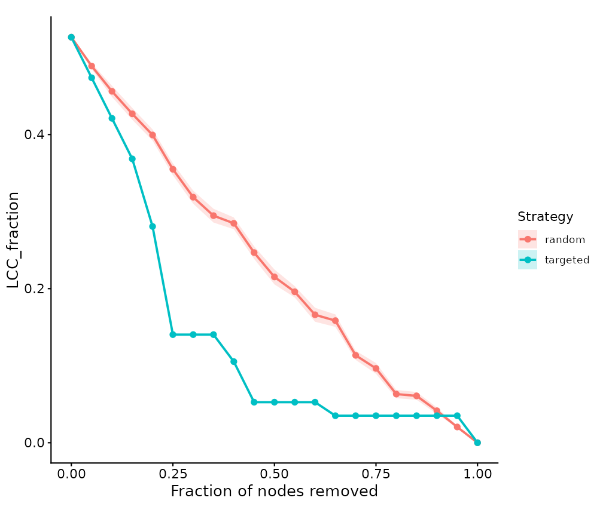
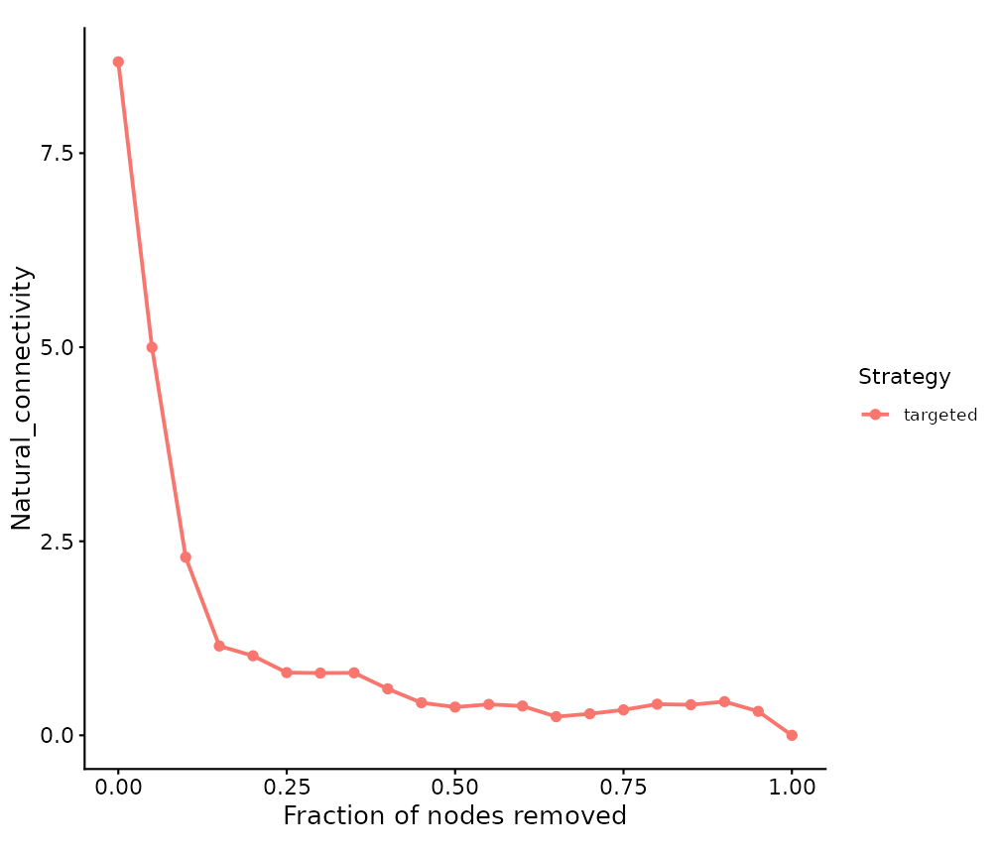
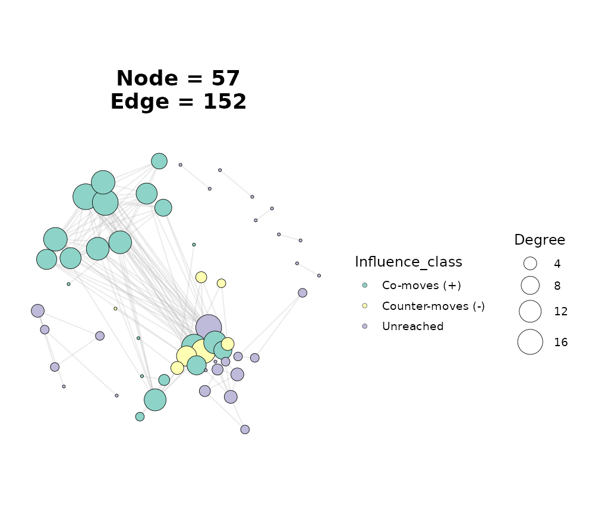

# Virtual Perturbation Analysis

## Overview

Once a network is built, a common question is *what happens to it under
disturbance* – if key taxa disappear, if one species is pushed up or
down, or if a whole module is lost. `ggNetView` groups these “virtual
perturbation” analyses into three functions that all take a `tbl_graph`
from any `build_graph_from_*()` constructor:

| Function | Perturbation type | Question it answers |
|----|----|----|
| [`get_network_perturbation()`](https://jiawang1209.github.io/ggNetView/reference/get_network_perturbation.md) | Structural (node/edge removal) | How fast does the network fall apart as nodes are lost? |
| [`get_node_influence()`](https://jiawang1209.github.io/ggNetView/reference/get_node_influence.md) | Abundance-influence propagation | If I nudge one species, how far does the ripple reach? |
| [`press_perturbation()`](https://jiawang1209.github.io/ggNetView/reference/press_perturbation.md) | Press (sustained-disturbance) approximation | If I keep suppressing/boosting a species, how does the community re-arrange? |

[`ggnetview_perturbation_curve()`](https://jiawang1209.github.io/ggNetView/reference/ggnetview_perturbation_curve.md)
draws the attack curve produced by the first function.

> **Interpretation caveat.** Correlation / co-occurrence networks encode
> *association, not causation*, and have no edge direction. The
> structural analysis (type 1) depends only on topology and is robust.
> The influence (type 2) and press (type 3) analyses borrow ideas from
> dynamical ecology but use correlations as proxies for interaction
> strengths – read their output as **qualitative scenarios**, not
> quantitative predictions.

``` r

library(ggNetView)
#> 
#>                                                ░██               ░██
#>                                                ░██
#>  ░████████  ░████████ ░████████   ░███████  ░████████ ░██    ░██ ░██ ░███████  ░██    ░██    ░██
#> ░██    ░██ ░██    ░██ ░██    ░██ ░██    ░██    ░██    ░██    ░██ ░██░██    ░██ ░██    ░██    ░██
#> ░██    ░██ ░██    ░██ ░██    ░██ ░█████████    ░██     ░██  ░██  ░██░█████████  ░██  ░████  ░██
#> ░██   ░███ ░██   ░███ ░██    ░██ ░██           ░██      ░██░██   ░██░██          ░██░██ ░██░██
#>  ░█████░██  ░█████░██ ░██    ░██  ░███████      ░████    ░███    ░██ ░███████     ░███   ░███
#>        ░██        ░██
#>  ░███████   ░███████
#> 
#> 
#> ggNetView: Reproducible and Deterministic Network Analysis and Visualization
#> Version: 0.2.1
#> 
#>   Authors:     Yue Liu, Chao Wang
#>   Maintainer:  Yue Liu <yueliu@iae.ac.cn>
#> 
#>   Manual:      https://jiawang1209.github.io/ggNetView-manual/
#>   GitHub:      https://github.com/Jiawang1209/ggNetView
#>   Bug Reports: https://github.com/Jiawang1209/ggNetView/issues
#> 
#>   Type citation('ggNetView') for how to cite this package.
```

## 1. Build a demo network

We reuse the bundled microbiome data and build a Spearman correlation
network, exactly as in the topology vignette.

``` r

data(otu_rare_relative)
data(tax_tab)

mat <- as.matrix(otu_rare_relative)
mat <- mat[order(rowSums(mat), decreasing = TRUE)[seq_len(80)], ]
annot <- tax_tab[tax_tab$OTUID %in% rownames(mat), ]

g <- build_graph_from_mat(
  mat             = mat,
  method          = "cor",
  cor.method      = "spearman",
  proc            = "BH",
  r.threshold     = 0.6,
  p.threshold     = 0.05,
  module.method   = "Fast_greedy",
  node_annotation = annot,
  seed            = 1
)
#> The max module in network is 11 we use the 11  modules for next analysis

g
#> # A tbl_graph: 57 nodes and 152 edges
#> #
#> # An undirected simple graph with 9 components
#> #
#> # Node Data: 57 × 14 (active)
#>    name   modularity modularity2 modularity3 Modularity Degree Strength Kingdom 
#>    <chr>  <fct>      <ord>       <chr>       <ord>       <dbl>    <dbl> <chr>   
#>  1 ASV_10 1          1           1           1              17    13.1  Bacteria
#>  2 ASV_2  1          1           1           1              16    12.5  Archaea 
#>  3 ASV_66 1          1           1           1              15    11.6  Bacteria
#>  4 ASV_44 1          1           1           1              13     9.90 Bacteria
#>  5 ASV_77 1          1           1           1              10     7.38 Bacteria
#>  6 ASV_64 1          1           1           1               9     6.53 Bacteria
#>  7 ASV_62 1          1           1           1               8     5.75 Bacteria
#>  8 ASV_33 1          1           1           1               4     3.26 Bacteria
#>  9 ASV_43 1          1           1           1               4     2.77 Bacteria
#> 10 ASV_32 1          1           1           1               3     2.36 Bacteria
#> # ℹ 47 more rows
#> # ℹ 6 more variables: Phylum <chr>, Class <chr>, Order <chr>, Family <chr>,
#> #   Genus <chr>, Species <chr>
#> #
#> # Edge Data: 152 × 5
#>    from    to weight correlation corr_direction
#>   <int> <int>  <dbl>       <dbl> <chr>         
#> 1    27    31  0.750       0.750 Positive      
#> 2    28    31  0.730       0.730 Positive      
#> 3     2    17  0.783       0.783 Positive      
#> # ℹ 149 more rows
```

## 2. Structural perturbation: random failure vs targeted attack

[`get_network_perturbation()`](https://jiawang1209.github.io/ggNetView/reference/get_network_perturbation.md)
removes nodes step by step and recomputes a panel of connectivity
metrics after each removal. The headline metric is `LCC_fraction` – the
size of the largest connected component relative to the original network
– and the single-number summary is the Schneider **R-index** (area under
the LCC curve; higher = more robust).

The most informative comparison is *random failure* against *targeted
attack* (removing the most-connected nodes first):

``` r

rnd <- get_network_perturbation(
  g, strategy = "random", bootstrap = 30, seed = 1, plot = FALSE
)

tgt <- get_network_perturbation(
  g, strategy = "targeted", centrality = "degree", plot = FALSE
)

rbind(rnd$robustness_index, tgt$robustness_index)
#>   strategy   R_index
#> 1   random 0.2347257
#> 2 targeted 0.1453634
```

A lower R-index under targeted attack is the classic signature of a
scale-free-like network: it tolerates random loss but is fragile to the
deliberate removal of hubs.

Overlay both curves with the companion plotting helper:

``` r

ggnetview_perturbation_curve(rbind(rnd$curve, tgt$curve))
#> Warning: Removed 21 rows containing missing values or values outside the scale range
#> (`geom_ribbon()`).
```



You can target any centrality (`"degree"`, `"strength"`,
`"betweenness"`, `"closeness"`, `"eigenvector"`, or `"ivi"`), and the
`curve` table also carries `Natural_connectivity`, `Efficiency`,
`Modularity` and more, so you can plot a different metric:

``` r

ggnetview_perturbation_curve(tgt$curve, metric = "Natural_connectivity")
```



### Knocking out a specific module or node set

Instead of a fraction sweep, you can remove a named module (a level of
the `Modularity` column) or an explicit set of nodes and read the
before/after change:

``` r

mods <- levels(get_graph_nodes(g)$Modularity)
ko <- get_network_perturbation(g, strategy = "module", target = mods[1])
ko$curve[ko$curve$metric %in% c("LCC_fraction", "N_components"), ]
#>    strategy fraction       metric     value value_sd value_se
#> 1    module 0.000000 LCC_fraction 0.5263158       NA       NA
#> 2    module 0.000000 N_components 9.0000000       NA       NA
#> 9    module 0.245614 LCC_fraction 0.2807018       NA       NA
#> 10   module 0.245614 N_components 9.0000000       NA       NA
```

## 3. Abundance-influence propagation

[`get_node_influence()`](https://jiawang1209.github.io/ggNetView/reference/get_node_influence.md)
injects a virtual perturbation at one or more source nodes and lets it
diffuse along the (signed) weighted edges, returning a per-node
`Influence` score. Positive vs negative values distinguish neighbours
that move with vs against the source.

``` r

hub <- get_graph_nodes(g) |>
  dplyr::arrange(dplyr::desc(Degree)) |>
  dplyr::pull(name) |>
  head(1)

g_infl <- get_node_influence(g, source = hub)

get_graph_nodes(g_infl) |>
  dplyr::arrange(dplyr::desc(abs(Influence))) |>
  dplyr::select(name, Modularity, Degree, Influence) |>
  head(8)
#>     name Modularity Degree   Influence
#> 1 ASV_41          2     17  0.07055545
#> 2  ASV_2          1     16  0.06542196
#> 3 ASV_39          2     17  0.06525645
#> 4 ASV_73          2     14  0.06224600
#> 5 ASV_66          1     15 -0.05980907
#> 6 ASV_44          1     13  0.05866859
#> 7  ASV_6          2     14  0.05639881
#> 8 ASV_17          2     13  0.05530194
```

Because the score is stored as a node column, you can map it onto a
network figure.
[`ggNetView()`](https://jiawang1209.github.io/ggNetView/reference/ggNetView.md)’s
`node_fill` aesthetic uses a discrete scale, so bin the signed influence
into a small categorical column first:

``` r

g_infl <- g_infl |>
  tidygraph::activate(nodes) |>
  tidygraph::mutate(Influence_class = dplyr::case_when(
    Influence > 0 ~ "Co-moves (+)",
    Influence < 0 ~ "Counter-moves (-)",
    TRUE          ~ "Unreached"
  ))

ggNetView(g_infl, layout = "fr", node_fill = "Influence_class")
```



## 4. Press perturbation (sustained disturbance)

[`press_perturbation()`](https://jiawang1209.github.io/ggNetView/reference/press_perturbation.md)
treats the signed correlation matrix as a proxy community matrix \\A\\,
adds negative self-regulation on the diagonal, and inverts it to get the
net-effect matrix \\N = -A^{-1}\\. Entry \\N\_{ij}\\ is the long-run net
response of species \\i\\ when species \\j\\ is held under sustained
pressure.

The diagonal is chosen automatically to guarantee a dynamically stable
matrix, and stability is reported:

``` r

pp <- press_perturbation(g)

c(stable = pp$stable,
  eigen_real_max = round(pp$eigen_real_max, 3),
  self_regulation = round(pp$self_regulation, 3))
#>          stable  eigen_real_max self_regulation 
#>           1.000          -1.000         -11.103
```

Query the consequences of continuously pressing the hub species – the
nodes with the largest absolute response are the ones most affected:

``` r

pp_hub <- press_perturbation(g, source = hub)
head(pp_hub$response, 8)
#>      name net_response
#> 1  ASV_10   0.16032271
#> 15 ASV_41   0.08101214
#> 16 ASV_39   0.07794091
#> 2   ASV_2   0.07336664
#> 18 ASV_73   0.07210790
#> 17  ASV_6   0.07207952
#> 19 ASV_17   0.06951217
#> 20 ASV_60   0.06885498
```

A positive `net_response` means that species tends to increase when the
source is boosted (and decrease when it is suppressed); a negative value
means the opposite.

## Where to go next

- [`vignette("network-topology")`](https://jiawang1209.github.io/ggNetView/articles/network-topology.md)
  – static topology and Zi-Pi keystone roles, the natural companion to
  the perturbation analyses here.
- [`vignette("node-importance")`](https://jiawang1209.github.io/ggNetView/articles/node-importance.md)
  – per-node centralities and the integrated influence (IVI) score,
  which can drive the `"ivi"` targeted attack above.
